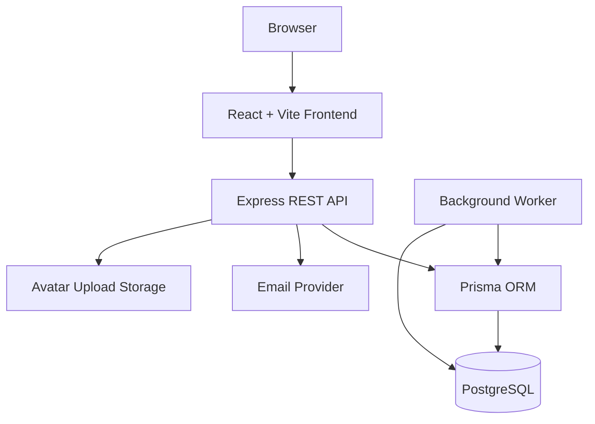

# Pundad System Design

This document explains how the Pundad frontend, backend, and database fit together. It is written as an interview-ready technical overview of the project.

## 1. Product Summary

Pundad is a social platform for dad jokes. Visitors can browse and search jokes, while registered users can create jokes, save drafts, publish content, comment, like jokes, maintain a daily streak, and earn badges. Admin users can moderate language and manage users.

The application supports Norwegian and English content in one shared system. User accounts are global, but jokes, tags, featured rankings, badges, and leaderboards are language-scoped.

## 2. High-Level Architecture



The frontend and backend are separate repositories. The frontend is a static React application. The backend is an Express API with a Prisma-backed PostgreSQL database. A separate worker process runs scheduled jobs for featured jokes and badges.

## 3. Runtime Architecture

Production runs behind Cloudflare and Nginx:

```text
User browser
  -> Cloudflare
  -> Nginx
     -> Static React assets
     -> /api/v1/* proxied to Express
     -> /uploads/* served as avatar assets
  -> PM2 process: pundad-api
  -> PM2 process: pundad-worker
  -> PostgreSQL
```

The API and worker are separate processes because they have different responsibilities:

- The API responds to user requests.
- The worker runs scheduled computations for daily/weekly/monthly features.

This keeps long-running or scheduled work out of the request path.

## 4. Frontend Design

The frontend is built with React, TypeScript, Vite, Tailwind CSS, React Router, Axios, and context providers.

Important frontend folders:

```text
src/api/          API endpoint constants
src/components/   Atoms, molecules, organisms
src/contexts/     Shared app state
src/hooks/        Reusable behavior
src/i18n/         Translation data
src/lib/          API clients and helpers
src/routes/       Layouts and pages
src/types/        TypeScript domain types
src/validators/   Frontend validation
```

### Main Frontend Contexts

| Context             | Responsibility                                                |
| ------------------- | ------------------------------------------------------------- |
| `AuthContext`       | Access token, auth status, auth loading state                 |
| `UserContext`       | Current user profile                                          |
| `LanguageContext`   | Active language, translation helpers, preferred-language sync |
| `JokesContext`      | Shared joke refresh behavior                                  |
| `ModerationContext` | Public moderation terms used for client-side checks           |
| `ColorThemeContext` | Light/dark theme state                                        |

The app bootstraps authentication on load. It attempts to refresh the access token using the HTTP-only refresh cookie, then fetches the current user with `/user/me`.

## 5. Backend Design

The backend is organized around route/controller/service separation.

```text
routes/       Express route definitions
controllers/  HTTP request parsing and response handling
services/     Business logic and Prisma database access
middleware/   Auth, role checks, validation, language, logging, uploads
validation/   Express Validator rule sets
jobs/         Scheduled ranking and badge jobs
utils/        Shared helpers
```

The request path is:

```text
Express route
  -> validation middleware
  -> authentication/authorization middleware
  -> controller
  -> service
  -> Prisma
  -> PostgreSQL
  -> successResponse/globalErrorHandler
```

This separation keeps HTTP concerns in controllers and business/database logic in services.

## 6. API Surface

The backend exposes versioned REST routes under `/api/v1`.

| Route group    | Purpose                                                                                |
| -------------- | -------------------------------------------------------------------------------------- |
| `/auth`        | Register, login, logout, refresh, email verification, password reset                   |
| `/user`        | Current user, profile updates, avatar upload, admin user lookup, user activation       |
| `/jokes`       | Joke listing, single joke, create, update, delete, drafts, search, like, random, daily |
| `/comments`    | Comment listing, edit, delete                                                          |
| `/tags`        | Tag-related operations                                                                 |
| `/badges`      | Current user badges and badge history                                                  |
| `/featured`    | Featured joke retrieval and admin recomputation                                        |
| `/leaderboard` | Hall of Fame users                                                                     |
| `/moderation`  | Admin moderation terms and public moderation terms                                     |
| `/contact`     | Contact form messages                                                                  |

## 7. Database Model

The database is PostgreSQL, modeled with Prisma.

Core tables:

| Model                    | Purpose                                                         |
| ------------------------ | --------------------------------------------------------------- |
| `User`                   | Account, profile, role, status, preferred language, streak data |
| `Joke`                   | User-generated joke content, language, draft/published status   |
| `Comment`                | Comments on jokes                                               |
| `Tag`                    | Language-scoped tags                                            |
| `JokeLike`               | Many-to-many like relationship between users and jokes          |
| `FeaturedJoke`           | Persisted computed feature winners                              |
| `BadgeAward`             | Historical badge records                                        |
| `CurrentUserBadge`       | Active badge display state                                      |
| `RefreshToken`           | Stored refresh tokens                                           |
| `ResetPasswordToken`     | Expiring password reset tokens                                  |
| `EmailVerificationToken` | Expiring email verification tokens                              |
| `ModerationTerm`         | Admin-managed blocked terms                                     |
| `ModerationEvent`        | Logs of blocked moderation attempts                             |
| `AuditLog`               | Admin/security-relevant events                                  |
| `ProductEvent`           | Product usage events                                            |

Key relationship examples:

- A `User` has many `Joke`, `Comment`, `JokeLike`, `BadgeAward`, and `CurrentUserBadge` records.
- A `Joke` belongs to a `User`, has many `Comment` and `JokeLike` records, and connects to many `Tag` records.
- `FeaturedJoke` stores a feature type, language, date, and winning joke.
- `Tag` has a compound uniqueness rule on language and name.
- `FeaturedJoke` has a compound uniqueness rule on type, date, and language.

## 8. Authentication Flow

Pundad uses short-lived access tokens plus refresh tokens in HTTP-only cookies.

### Registration

```text
User submits registration form
  -> frontend validates form
  -> POST /api/v1/auth/register
  -> backend validates fields
  -> backend moderates username
  -> password is hashed
  -> user is created with emailVerified=false
  -> email verification token is generated
  -> verification email is sent
```

Users must accept the current legal terms before registration is accepted.

### Login

```text
User submits username/email + password
  -> POST /api/v1/auth/login
  -> backend checks user existence, active status, email verification, password
  -> backend creates access token and refresh token
  -> refresh token is stored in database
  -> refresh token is sent as HTTP-only cookie
  -> access token and user payload are returned to frontend
```

### Session Restore

```text
App loads
  -> frontend calls /auth/refresh with credentials
  -> backend verifies refresh cookie and DB token
  -> backend rotates refresh token
  -> backend returns new access token
  -> frontend calls /user/me
  -> frontend stores current user in context
```

### Authorization

The backend protects sensitive actions with middleware:

- `isAuthenticated` verifies the access token.
- `isAdmin` requires the `ADMIN` role.
- Ownership middleware protects joke, comment, and user mutations.
- Admins can perform privileged actions such as user activation and moderation-term management.

## 9. Language Architecture

Pundad supports `NO` and `EN`.

The frontend stores and sends the active language. The backend resolves language through:

```text
X-App-Language header
  or ?lang= query parameter
  -> normalizeLanguage()
  -> req.language
```

All language-aware service methods receive that language and include it in Prisma queries.

Language-scoped data includes:

- Jokes
- Tags
- Featured joke records
- Badge awards
- Current badges
- Leaderboard calculations

Global user data includes:

- Account identity
- Email/password
- Role
- Avatar
- Active/deleted state
- Daily joke streak
- Preferred language

This design lets one user participate in both language communities without duplicating their account.

## 10. Joke Lifecycle

### Create Draft

```text
Authenticated user fills New Joke form
  -> frontend validates length and blocked terms
  -> POST /jokes with published=false
  -> backend validates and moderates again
  -> joke is stored with current language
  -> tags are normalized and connect-or-created per language
```

### Publish Joke

```text
Authenticated user publishes a joke
  -> POST /jokes with published=true
  -> backend stores published joke
  -> product event JOKE_PUBLISHED is logged
  -> joke appears in public language-specific feeds
```

### Update Joke

```text
User edits owned joke
  -> PATCH /jokes/:id
  -> auth and ownership middleware run
  -> service checks joke belongs to active language
  -> joke fields and tag relationships are updated
```

### Delete Joke

```text
User deletes owned joke
  -> DELETE /jokes/:id
  -> auth and ownership middleware run
  -> joke is deleted only if id and language match
  -> related comments/likes are removed through database relations
```

## 11. Comments, Likes, Search, and Pagination

Comments are attached to jokes and can be created by authenticated users. Comment edit/delete actions are protected by ownership/admin middleware.

Likes are stored in `JokeLike` with a compound unique key on `jokeId` and `userId`, preventing duplicate likes from the same user.

Search supports filters for:

- Title
- Body
- Comments
- Tags

The backend builds Prisma `OR` conditions from the search terms and selected filters, while keeping results language-scoped and published-only.

The frontend uses a custom `usePagination` hook that supports:

- Page-based navigation
- Infinite loading
- Request deduplication
- Stale response protection
- Item update/replacement/removal helpers

## 12. Featured Joke System

Featured results are computed server-side and persisted in the database.

Feature types:

| Feature               | Window            | Selection                                     |
| --------------------- | ----------------- | --------------------------------------------- |
| `DAILY_JOKE`          | Current UTC day   | Deterministic daily pick from published jokes |
| `TRENDING_WEEK`       | Current UTC week  | Joke with most likes                          |
| `MOST_COMMENTED_WEEK` | Current UTC week  | Joke with most comments                       |
| `FASTEST_GROWING`     | Last 24 hours     | Joke with most recent likes                   |
| `TOP_CREATOR_MONTH`   | Current UTC month | User with most published jokes                |

The worker runs computations for all supported languages:

```text
NO
EN
```

The jobs are idempotent. Each feature uses a database uniqueness constraint such as `(type, date, language)` to prevent duplicate winners. If two processes compute the same feature at the same time, the service handles the unique-constraint conflict as a race condition instead of creating duplicate data.

## 13. Badge System

The badge system has two layers:

| Table              | Purpose                                   |
| ------------------ | ----------------------------------------- |
| `BadgeAward`       | Permanent historical record of badge wins |
| `CurrentUserBadge` | Current badge display state               |

Examples of badges:

- Joke of the Day
- Top Creator Month
- Trending Week
- Most Commented Week
- Fastest Growing
- Streak
- Admin

When a featured job creates a winner, it also awards the matching badge. Badge writes use Prisma upserts so repeated job runs do not create duplicate records.

## 14. Hall of Fame Leaderboard

The leaderboard is computed from language-scoped activity.

Inputs include:

- Feature wins from `BadgeAward`
- Likes received on jokes
- Comments received on jokes
- Current daily joke streak
- Best streak

Feature wins are weighted:

| Badge               | Weight |
| ------------------- | ------ |
| Top Creator Month   | 5      |
| Joke of the Day     | 4      |
| Fastest Growing     | 3      |
| Trending Week       | 3      |
| Most Commented Week | 2      |

The service supports `week`, `month`, and `all` periods, then sorts users by featured score, win count, likes received, streak, and comments received.

## 15. Moderation System

Pundad uses both client-side and backend moderation.

Client-side moderation:

- The frontend fetches public blocked terms.
- Forms check usernames, titles, bodies, comments, and tags before submission.
- This gives immediate feedback to the user.

Backend moderation:

- The backend loads active terms into an in-memory cache on server start.
- Admins can create, update, deactivate, delete, and reload terms.
- The backend performs authoritative moderation before writes.
- Blocked attempts are logged in `ModerationEvent`.

The matching logic normalizes input with:

- Lowercasing
- Diacritic removal
- Zero-width character removal
- Punctuation stripping
- Repeated-character collapsing
- Basic leetspeak mapping

This catches simple obfuscation attempts while keeping the implementation understandable.

## 16. Avatar Uploads

Profile avatar updates use multipart form data.

The upload flow:

```text
Frontend validates file size/type
  -> PATCH /user/:id
  -> upload middleware accepts image
  -> backend validates actual file data
  -> Sharp resizes/compresses image
  -> WebP avatar is stored
  -> public avatar URL is returned in user payload
```

The frontend uses `VITE_API_ORIGIN` to build avatar URLs.

## 17. Email Flows

Email is used for:

- Account verification
- Resending verification
- Password reset
- Pending email-change verification
- Contact form routing

The backend stores hashed verification/reset tokens with expiry timestamps. Raw tokens are only sent to the user through email links.

## 18. Logging and Observability

The backend includes request context and structured logging through Pino.

The database stores:

- `ProductEvent` for important product actions such as registration, login, search, and publishing.
- `ModerationEvent` for blocked moderation attempts.
- `AuditLog` for admin/security-relevant events.

In production, PM2 manages both API and worker logs.

## 19. Security Design

Important security decisions:

- Passwords are hashed with bcrypt.
- Refresh tokens are stored in HTTP-only cookies.
- Refresh tokens are also stored server-side, allowing validation and rotation.
- Access-token protected routes use authentication middleware.
- Admin routes require role checks.
- Ownership checks protect joke/comment/profile mutations.
- Express Validator validates incoming data.
- Backend moderation is authoritative.
- CORS is allowlisted.
- Helmet sets security headers.
- HPP blocks HTTP parameter pollution.
- API body size limits reduce abuse.
- Rate limiters protect auth, registration, uploads, profile updates, contact, and read-heavy routes.
- Avatar uploads validate file size, type, and image content.

## 20. Deployment Model

Frontend:

- Built with Vite
- Deployed as static files
- Served by Nginx

Backend:

- Runs as `pundad-api` PM2 process
- Listens on localhost in production
- Receives proxied API traffic from Nginx

Worker:

- Runs as `pundad-worker` PM2 process
- Starts the scheduler
- Computes featured rankings for both languages

Database:

- PostgreSQL
- Schema managed with Prisma migrations

Edge/proxy:

- Cloudflare handles DNS/TLS/protection.
- Nginx serves static files, proxies API traffic, and exposes uploaded avatars.

## 21. Important Tradeoffs

### Separate Repositories Instead of Monorepo

The frontend and backend are separate repositories. This keeps deployment and ownership boundaries simple, but it means cross-repo changes require discipline when API contracts change.

### Server-Side Featured Computation

Featured jokes are computed and stored by the backend instead of calculated in the browser. This gives consistent results for all users, enables badge awards, and makes the system easier to explain and test.

### Client Plus Backend Moderation

Client moderation improves UX, but backend moderation remains the source of truth. This is important because browser checks can be bypassed.

### Language-Scoped Content, Shared Accounts

Separating content by language avoids mixing Norwegian and English jokes while preserving one identity per user. This adds complexity to queries and badges, but it creates a cleaner user experience.

### Database-Backed Refresh Tokens

Refresh tokens are stored in the database instead of being stateless only. This adds database writes but gives better control over session validity, token rotation, logout, and suspicious sessions.

## 22. Interview Talking Points

Useful ways to explain the project in an interview:

- "I built a full-stack social platform, not just CRUD. It includes auth, moderation, background jobs, rankings, badges, and deployment."
- "The frontend and backend are separate repos, which mirrors many production JAMstack setups."
- "The backend uses a route/controller/service structure so HTTP handling is separated from business logic."
- "Language is resolved once in middleware and passed into services, keeping content isolation consistent."
- "Featured rankings are computed in a worker process and persisted to the database so every user sees the same results."
- "Badge awarding uses idempotent upserts to avoid duplicates when jobs rerun."
- "The app uses HTTP-only refresh-token cookies plus access tokens to balance security and frontend ergonomics."
- "Moderation is checked in the frontend for UX, but enforced in the backend for security."
- "The leaderboard is not just raw joke count. It weights feature wins and engagement to make the ranking harder to spam."
- "The project is deployed with real infrastructure: Nginx, PM2, Cloudflare, PostgreSQL, and a separate background worker."

## 23. Risk Areas and Future Improvements

Known areas that deserve the most testing:

- Auth refresh and session restore
- Email verification and password reset
- Norwegian/English content separation
- Joke drafts versus published jokes
- Featured job recomputation and badge idempotency
- Admin-only access control
- Avatar upload validation
- Search filters across title, body, comments, and tags
- Moderation term cache reload behavior

Future improvements:

- Backend integration tests for services and routes
- Frontend route/component tests
- End-to-end tests for the critical user journeys
- Redis caching for leaderboard and featured reads
- Queue-based background jobs
- Admin audit-log UI
- User report/flag workflow
- WebSocket or server-sent event updates for live leaderboard changes
